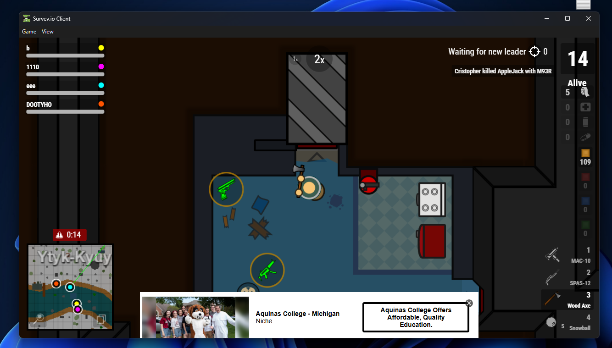
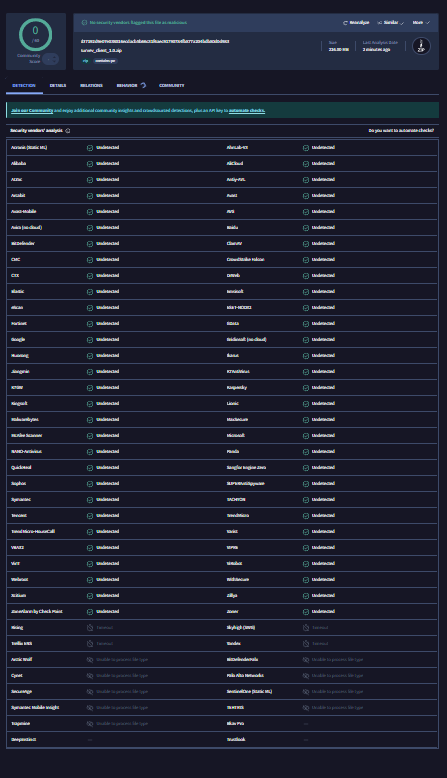

# Survev.io Client

Welcome to the official repository for the Survev.io client. This client is designed to provide an enhanced gaming experience with optimized performance and additional features.

## Gameplay Preview

## Key Features

*   **Uncapped FPS:** Experience smoother gameplay with an uncapped frame rate. The client utilizes specialized performance flags and overrides `requestAnimationFrame` to bypass standard browser limitations.
*   **Performance Optimized:** Built with efficiency in mind to ensure low latency and high responsiveness during intense matches.
*   **Easy Setup:** Simple installation process to get you into the game quickly.

## Security & Transparency

We prioritize the security of our users. To ensure transparency, we encourage everyone to verify the client files independently.

### VirusTotal Scan Results
Below is a recent scan of the client executable, showing a clean report from multiple security vendors.

> **Note:** *Don't trust us, check VirusTotal to scan the file yourself for peace of mind.*

## Installation

1. Download the latest release from the [Releases](https://github.com/undon995/survev-client/releases) page.
2. Extract the files to your preferred directory.
3. Run `SurvevClient.exe` to start the game.

---
*Disclaimer: This is a third-party client and is not officially affiliated with the Survev.io developers.*
